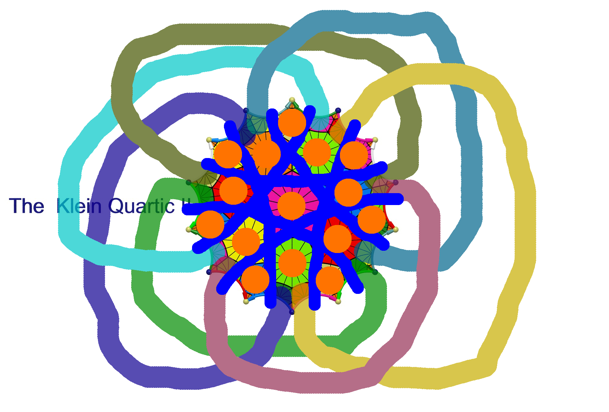
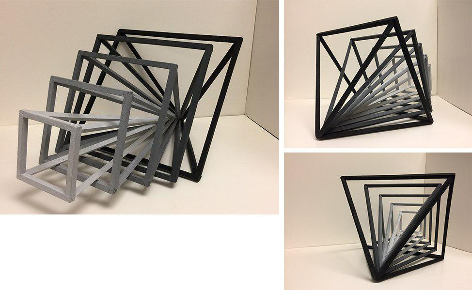

* Фишки продукта

  * Элегантность и простота, юзабилити + красивые решения
    * Благодаря модели отмен система всегда открыта для любых новых транзакций
    * Возможность строить цепочку транзакций в любой момент и закомитить в будущем в леджер

  * Удобство и контроль, красивые решения + анализ
    * Самый независимый и гибкий консенсус
    * Импорт публичных приватных ключей из всех криптовалют

  * Новые возможности, анализ + учёт
    * Учёт в консенсусе не только вычислительных мощьностей но и сетевых возможностей
    * Хоршо продуманный и удобный PoS используемый как для валют так и для бонусов

  * Передовые технологии, учёт + инновации
    * Поддержка публикации транзакции отдельно даже без микроблока
    * Паралельные макроблоки и своя команда публикаторов для каждого микроблока это инновационные возможности публикации без преград

  * Современная безопасность, инновации + безопасность
    * Стэк мультиподписей, любые комбинации ключей прав и ролей на все случаи
      * Требование на наличие нужного количества подписей из общего количества подписей
      * Требование всеобщего согласия и одновременного наличия всех подписей всех ответственных лиц
      * Возможность подписыванием одним ключём из списка при наличии хотябы одного подписывателя
      * Возможность пополнения стэка мультиподписей новыми сотрудниками и учасниками
      * Возможность ликвидации прав для отдельных ключей или групп в случае кражи ключей с возможностью заготовленной замены
    * Заверительная передача приватного ключа с поддержкой требований на заверительное подписывание

  * Большие возможности, безопасность + эффективность
    * Шардинг и пудликация больших объёмов данных
    * Шардинг менеджер эффективно разгружающий объём дискового пространство в фоновом режиме
    * При огромном количестве транзакций гарантия наличия всех необходимых транзакций для подсчёта итогового баланса

  * Доступность и соответствие ожиданиям, эффективность + свобода
    * Любой компьютер может принять участие в работе системы

  * Гарантия качества, свобода + юзабилити
    * Поддержва платных транзакций с гарантией параметров качества
      * Скорость появления в леджере
      * Доступность объёма данных после публикации
      * Уровень безопасности консенсуса и доп верификаций

* План деятельности продукта

  * Нормы и длительная стабильная работа проекта

  * Как будет протекать деятельность проекта

  * Как компоненты системы работают и взаимносогласуются

  * Намеренье проекта

  * Важные и ответственные моменты работы протокола системы

  * К чему надо готовиться

  * Наполнение проекта

  * Узнаваемость продукта и понимание что он делает и даёт

  * Продукт вошел в повседневную жизь пользователя как обычное явление

* Что представляет из себя проект как продукт

  * Дизайн идея, стиль и внешний вид

  * Ресурсы и расчёт производительности

  * Что делает проект успешным, смысл и польза, что в проекте важно для жизни системы и результата

  * Что представляет система в инноваторском смысле, новое слово в технике децентрализованной отдачи контента и защищенной трансляции

  * Администрирование, журналы, отчёты, прафилактические меры, что такое нормальная деятельность пользователя

  * Сервисы которые получают пользователи, возможности, сильные стороны системы

  * Идея комьюнити, коменты, лайки, возможность развития системы пользователями

  * Продвигаемое мнение о проекте и впечатления публики

* Сущьность проекта

  * Адаптивность системы для задач и людей

  * Меры и барьеры при доступе и распределении, удерживание контроля при возможностях публикации дубликации доступности

  * Отчёт и контроль, взгляд на работу системы

  * Структура технических решений

  * Жизнь работа и наполнение системы

  * Стойкость и сложность системы

  * Зоны контроля утечки информации, и меры реагирования защиты

* Средства и элементы достижения целей и задач

  * Цели

  * Самые базовые средства

  * Интегрирование системы в слаженную работу

  * Вспомогательные средства

  * Качество сервиса, параметры системы

  * Результаты

* Работа системы

  * Ниши системы, модульность и компонентность, роли нормы функции и их взаимное отношение

  * Масштабирование, находимость востребованного контента

  * Учёт важных параметров приоритеты и уместность, грамотная расстановка

  * Инновационность системы, повышенный рост нагрузки и стрессовые ситуации, влияние популярности и роста сети и контента

  * Парадигма стабильности, стойкость от хакерских атак, целостность системы

* Система и реальный мир

  * Взаимодействие системы в глобальном смысле

  * Основная база проекта

  * Ресурсы пользователя и их использование

  * Интерактивность в работе пользователя и системы

* Что проходит через систему

  * С каким контентом и событиями работает система и для какого контента и событий она создана в широком понимании этого слова

  * Какой контент и события можно использовать в системе максимально эффективно и без ограничений

  * Качественная база нужного хорошего содержания и сетевая готовность к востребованным событиям

* Итоги деятельности

  * Индекс системы, что на данный момент содержит система и в каком состоянии она находится

  * Как следить за каждодневными изменениями в системы, какие показатели меняются

| Size |    | Date |    | Path |
|----|----|----|----|-------|
|     ``984``| ``Mar``| ``3``| ``01:16``| [``Enqm``](Enqm) |
|     ``20``| ``Mar``| ``3``| ``01:16``| [``Enqm.hs``](Enqm.hs) |
|     ``228``| ``Mar``| ``14``| ``15:12``| [``Enqm/API``](Enqm/API) |
|     ``23``| ``Mar``| ``3``| ``01:16``| [``Enqm/API.hs``](Enqm/API.hs) |
|     ``116``| ``Mar``| ``3``| ``01:16``| [``Enqm/API/RPC``](Enqm/API/RPC) |
|     ``305``| ``Mar``| ``3``| ``01:16``| [``Enqm/API/RPC.hs``](Enqm/API/RPC.hs) |
|     ``1539``| ``Mar``| ``3``| ``01:16``| [``Enqm/API/RPC/Generic.hs``](Enqm/API/RPC/Generic.hs) |
|     ``1655``| ``Mar``| ``3``| ``01:16``| [``Enqm/API/RPC/Instances.hs``](Enqm/API/RPC/Instances.hs) |
|     ``436``| ``Mar``| ``3``| ``01:16``| [``Enqm/API/Types.hs``](Enqm/API/Types.hs) |
|     ``3781``| ``Mar``| ``3``| ``01:16``| [``Enqm/API/Methods.hs``](Enqm/API/Methods.hs) |
|     ``42``| ``Mar``| ``3``| ``01:16``| [``Enqm/API/UnixShell``](Enqm/API/UnixShell) |
|     ``34``| ``Mar``| ``3``| ``01:16``| [``Enqm/API/UnixShell.hs``](Enqm/API/UnixShell.hs) |
|     ``582``| ``Mar``| ``3``| ``01:16``| [``Enqm/API/UnixShell/Generated.hs``](Enqm/API/UnixShell/Generated.hs) |
|     ``70``| ``Mar``| ``3``| ``01:16``| [``Enqm/Nell``](Enqm/Nell) |
|     ``33``| ``Mar``| ``3``| ``01:16``| [``Enqm/Nell/Eneqnell.hs``](Enqm/Nell/Eneqnell.hs) |
|     ``113``| ``Mar``| ``3``| ``01:16``| [``Enqm/Nell/Sharnell.hs``](Enqm/Nell/Sharnell.hs) |
|     ``104``| ``Mar``| ``3``| ``01:16``| [``Enqm/Nell/Stereonell.hs``](Enqm/Nell/Stereonell.hs) |
|     ``36``| ``Mar``| ``3``| ``01:16``| [``Enqm/Block``](Enqm/Block) |
|     ``25``| ``Mar``| ``3``| ``01:16``| [``Enqm/Block.hs``](Enqm/Block.hs) |
|     ``31``| ``Mar``| ``3``| ``01:16``| [``Enqm/Block/Micro.hs``](Enqm/Block/Micro.hs) |
|     ``32``| ``Mar``| ``3``| ``01:16``| [``Enqm/Block/Classic.hs``](Enqm/Block/Classic.hs) |
|     ``150``| ``Mar``| ``3``| ``01:16``| [``Enqm/Model``](Enqm/Model) |
|     ``114``| ``Mar``| ``3``| ``01:16``| [``Enqm/Model/Folding``](Enqm/Model/Folding) |
|     ``41``| ``Mar``| ``3``| ``01:16``| [``Enqm/Model/Folding/HashLink.hs``](Enqm/Model/Folding/HashLink.hs) |
|     ``46``| ``Mar``| ``3``| ``01:16``| [``Enqm/Model/Folding/HashSequence.hs``](Enqm/Model/Folding/HashSequence.hs) |
|     ``46``| ``Mar``| ``3``| ``01:16``| [``Enqm/Model/Folding/LedgerPoints.hs``](Enqm/Model/Folding/LedgerPoints.hs) |
|     ``46``| ``Mar``| ``3``| ``01:16``| [``Enqm/Model/Folding/ShardingLevel.hs``](Enqm/Model/Folding/ShardingLevel.hs) |
|     ``36``| ``Mar``| ``3``| ``01:16``| [``Enqm/Model/Branching.hs``](Enqm/Model/Branching.hs) |
|     ``36``| ``Mar``| ``3``| ``01:16``| [``Enqm/Model/Migration.hs``](Enqm/Model/Migration.hs) |
|     ``38``| ``Mar``| ``3``| ``01:16``| [``Enqm/Model/Archivation.hs``](Enqm/Model/Archivation.hs) |
|     ``39``| ``Mar``| ``3``| ``01:16``| [``Enqm/Model/Cancellation.hs``](Enqm/Model/Cancellation.hs) |
|     ``38``| ``Mar``| ``3``| ``01:16``| [``Enqm/Model/Prolongation.hs``](Enqm/Model/Prolongation.hs) |
|     ``70``| ``Mar``| ``3``| ``01:16``| [``Enqm/Smart``](Enqm/Smart) |
|     ``88``| ``Mar``| ``3``| ``01:16``| [``Enqm/Smart/Logic``](Enqm/Smart/Logic) |
|     ``26``| ``Mar``| ``3``| ``01:16``| [``Enqm/Smart/Logic/PetriNet``](Enqm/Smart/Logic/PetriNet) |
|     ``40``| ``Mar``| ``3``| ``01:16``| [``Enqm/Smart/Logic/PetriNet.hs``](Enqm/Smart/Logic/PetriNet.hs) |
|     ``50``| ``Mar``| ``3``| ``01:16``| [``Enqm/Smart/Logic/PetriNet/Logarithms.hs``](Enqm/Smart/Logic/PetriNet/Logarithms.hs) |
|     ``40``| ``Mar``| ``3``| ``01:16``| [``Enqm/Smart/Logic/Operators.hs``](Enqm/Smart/Logic/Operators.hs) |
|     ``42``| ``Mar``| ``3``| ``01:16``| [``Enqm/Smart/Logic/Signatures.hs``](Enqm/Smart/Logic/Signatures.hs) |
|     ``72``| ``Mar``| ``3``| ``01:16``| [``Enqm/Smart/Events``](Enqm/Smart/Events) |
|     ``39``| ``Mar``| ``3``| ``01:16``| [``Enqm/Smart/Events/Effect.hs``](Enqm/Smart/Events/Effect.hs) |
|     ``41``| ``Mar``| ``3``| ``01:16``| [``Enqm/Smart/Events/Planning.hs``](Enqm/Smart/Events/Planning.hs) |
|     ``45``| ``Mar``| ``3``| ``01:16``| [``Enqm/Smart/Events/Actualization.hs``](Enqm/Smart/Events/Actualization.hs) |
|     ``56``| ``Mar``| ``3``| ``01:16``| [``Enqm/Smart/Ticket``](Enqm/Smart/Ticket) |
|     ``38``| ``Mar``| ``3``| ``01:16``| [``Enqm/Smart/Ticket/Token.hs``](Enqm/Smart/Ticket/Token.hs) |
|     ``39``| ``Mar``| ``3``| ``01:16``| [``Enqm/Smart/Ticket/Cheques.hs``](Enqm/Smart/Ticket/Cheques.hs) |
|     ``40``| ``Mar``| ``3``| ``01:16``| [``Enqm/Smart/Ticket/Marking.hs``](Enqm/Smart/Ticket/Marking.hs) |
|     ``104``| ``Mar``| ``3``| ``01:16``| [``Enqm/Smart/Contract``](Enqm/Smart/Contract) |
|     ``41``| ``Mar``| ``3``| ``01:16``| [``Enqm/Smart/Contract/Moments.hs``](Enqm/Smart/Contract/Moments.hs) |
|     ``44``| ``Mar``| ``3``| ``01:16``| [``Enqm/Smart/Contract/Occupancy.hs``](Enqm/Smart/Contract/Occupancy.hs) |
|     ``45``| ``Mar``| ``3``| ``01:16``| [``Enqm/Smart/Contract/Consequence.hs``](Enqm/Smart/Contract/Consequence.hs) |
|     ``48``| ``Mar``| ``3``| ``01:16``| [``Enqm/Smart/Contract/Preconditions.hs``](Enqm/Smart/Contract/Preconditions.hs) |
|     ``104``| ``Mar``| ``3``| ``01:16``| [``Enqm/Smart/Functional``](Enqm/Smart/Functional) |
|     ``5095``| ``Mar``| ``3``| ``01:16``| [``Enqm/Smart/Functional/PureState.hs``](Enqm/Smart/Functional/PureState.hs) |
|     ``47``| ``Mar``| ``3``| ``01:16``| [``Enqm/Smart/Functional/Indicators.hs``](Enqm/Smart/Functional/Indicators.hs) |
|     ``86``| ``Mar``| ``3``| ``01:16``| [``Enqm/Smart/Functional/StateLinking``](Enqm/Smart/Functional/StateLinking) |
|     ``48``| ``Mar``| ``3``| ``01:16``| [``Enqm/Smart/Functional/StateLinking.hs``](Enqm/Smart/Functional/StateLinking.hs) |
|     ``58``| ``Mar``| ``3``| ``01:16``| [``Enqm/Smart/Functional/StateLinking/Security.hs``](Enqm/Smart/Functional/StateLinking/Security.hs) |
|     ``61``| ``Mar``| ``3``| ``01:16``| [``Enqm/Smart/Functional/StateLinking/Automaticity.hs``](Enqm/Smart/Functional/StateLinking/Automaticity.hs) |
|     ``64``| ``Mar``| ``3``| ``01:16``| [``Enqm/Smart/Functional/StateLinking/Responsibility.hs``](Enqm/Smart/Functional/StateLinking/Responsibility.hs) |
|     ``106``| ``Mar``| ``3``| ``01:16``| [``Enqm/Ledger``](Enqm/Ledger) |
|     ``26``| ``Mar``| ``3``| ``01:16``| [``Enqm/Ledger.hs``](Enqm/Ledger.hs) |
|     ``35``| ``Mar``| ``3``| ``01:16``| [``Enqm/Ledger/Security.hs``](Enqm/Ledger/Security.hs) |
|     ``36``| ``Mar``| ``3``| ``01:16``| [``Enqm/Ledger/MapReduce.hs``](Enqm/Ledger/MapReduce.hs) |
|     ``38``| ``Mar``| ``3``| ``01:16``| [``Enqm/Ledger/Memoization.hs``](Enqm/Ledger/Memoization.hs) |
|     ``40``| ``Mar``| ``3``| ``01:16``| [``Enqm/Ledger/ControlPoints.hs``](Enqm/Ledger/ControlPoints.hs) |
|     ``190``| ``Mar``| ``3``| ``01:16``| [``Enqm/Ecology``](Enqm/Ecology) |
|     ``182``| ``Mar``| ``3``| ``01:16``| [``Enqm/Ecology/Branch``](Enqm/Ecology/Branch) |
|     ``38``| ``Mar``| ``3``| ``01:16``| [``Enqm/Ecology/Branch/Top.hs``](Enqm/Ecology/Branch/Top.hs) |
|     ``41``| ``Mar``| ``3``| ``01:16``| [``Enqm/Ecology/Branch/Leader.hs``](Enqm/Ecology/Branch/Leader.hs) |
|     ``41``| ``Mar``| ``3``| ``01:16``| [``Enqm/Ecology/Branch/Middle.hs``](Enqm/Ecology/Branch/Middle.hs) |
|     ``41``| ``Mar``| ``3``| ``01:16``| [``Enqm/Ecology/Branch/Reward.hs``](Enqm/Ecology/Branch/Reward.hs) |
|     ``41``| ``Mar``| ``3``| ``01:16``| [``Enqm/Ecology/Branch/BigData.hs``](Enqm/Ecology/Branch/BigData.hs) |
|     ``42``| ``Mar``| ``3``| ``01:16``| [``Enqm/Ecology/Branch/Dumping.hs``](Enqm/Ecology/Branch/Dumping.hs) |
|     ``43``| ``Mar``| ``3``| ``01:16``| [``Enqm/Ecology/Branch/Private.hs``](Enqm/Ecology/Branch/Private.hs) |
|     ``45``| ``Mar``| ``3``| ``01:16``| [``Enqm/Ecology/Branch/DataSupport.hs``](Enqm/Ecology/Branch/DataSupport.hs) |
|     ``46``| ``Mar``| ``3``| ``01:16``| [``Enqm/Ecology/Branch/Statistical.hs``](Enqm/Ecology/Branch/Statistical.hs) |
|     ``35``| ``Mar``| ``3``| ``01:16``| [``Enqm/Ecology/Scaling.hs``](Enqm/Ecology/Scaling.hs) |
|     ``37``| ``Mar``| ``3``| ``01:16``| [``Enqm/Ecology/Checking.hs``](Enqm/Ecology/Checking.hs) |
|     ``35``| ``Mar``| ``3``| ``01:16``| [``Enqm/Ecology/Filtring.hs``](Enqm/Ecology/Filtring.hs) |
|     ``36``| ``Mar``| ``3``| ``01:16``| [``Enqm/Ecology/Security.hs``](Enqm/Ecology/Security.hs) |
|     ``100``| ``Mar``| ``3``| ``01:16``| [``Enqm/Ecology/Sharding``](Enqm/Ecology/Sharding) |
|     ``36``| ``Mar``| ``3``| ``01:16``| [``Enqm/Ecology/Sharding.hs``](Enqm/Ecology/Sharding.hs) |
|     ``20``| ``Mar``| ``3``| ``01:16``| [``Enqm/Ecology/Sharding/Seeding``](Enqm/Ecology/Sharding/Seeding) |
|     ``44``| ``Mar``| ``3``| ``01:16``| [``Enqm/Ecology/Sharding/Seeding.hs``](Enqm/Ecology/Sharding/Seeding.hs) |
|     ``52``| ``Mar``| ``3``| ``01:16``| [``Enqm/Ecology/Sharding/Seeding/Outline.hs``](Enqm/Ecology/Sharding/Seeding/Outline.hs) |
|     ``62``| ``Mar``| ``3``| ``01:16``| [``Enqm/Ecology/Sharding/Background``](Enqm/Ecology/Sharding/Background) |
|     ``54``| ``Mar``| ``3``| ``01:16``| [``Enqm/Ecology/Sharding/Background/Garbage.hs``](Enqm/Ecology/Sharding/Background/Garbage.hs) |
|     ``55``| ``Mar``| ``3``| ``01:16``| [``Enqm/Ecology/Sharding/Background/Manager.hs``](Enqm/Ecology/Sharding/Background/Manager.hs) |
|     ``56``| ``Mar``| ``3``| ``01:16``| [``Enqm/Ecology/Sharding/Background/Mutality.hs``](Enqm/Ecology/Sharding/Background/Mutality.hs) |
|     ``82``| ``Mar``| ``3``| ``01:16``| [``Enqm/Ecology/Sharding/Tranquality``](Enqm/Ecology/Sharding/Tranquality) |
|     ``58``| ``Mar``| ``3``| ``01:16``| [``Enqm/Ecology/Sharding/Tranquality/Adaptivity.hs``](Enqm/Ecology/Sharding/Tranquality/Adaptivity.hs) |
|     ``58``| ``Mar``| ``3``| ``01:16``| [``Enqm/Ecology/Sharding/Tranquality/Consistency.hs``](Enqm/Ecology/Sharding/Tranquality/Consistency.hs) |
|     ``62``| ``Mar``| ``3``| ``01:16``| [``Enqm/Ecology/Sharding/Tranquality/Peparedness.hs``](Enqm/Ecology/Sharding/Tranquality/Peparedness.hs) |
|     ``74``| ``Mar``| ``3``| ``01:16``| [``Enqm/Ecology/Sharding/Distribution``](Enqm/Ecology/Sharding/Distribution) |
|     ``58``| ``Mar``| ``3``| ``01:16``| [``Enqm/Ecology/Sharding/Distribution/Planning.hs``](Enqm/Ecology/Sharding/Distribution/Planning.hs) |
|     ``1021``| ``Mar``| ``3``| ``01:16``| [``Enqm/Ecology/Sharding/Distribution/Assurance.hs``](Enqm/Ecology/Sharding/Distribution/Assurance.hs) |
|     ``283``| ``Mar``| ``3``| ``01:16``| [``Enqm/Ecology/Sharding/Distribution/Percolation.hs``](Enqm/Ecology/Sharding/Distribution/Percolation.hs) |
|     ``37``| ``Mar``| ``3``| ``01:16``| [``Enqm/Ecology/Atmosphere.hs``](Enqm/Ecology/Atmosphere.hs) |
|     ``38``| ``Mar``| ``3``| ``01:16``| [``Enqm/Ecology/Duplication.hs``](Enqm/Ecology/Duplication.hs) |
|     ``236``| ``Mar``| ``3``| ``01:16``| [``Enqm/Network``](Enqm/Network) |
|     ``28``| ``Mar``| ``3``| ``01:16``| [``Enqm/Network.hs``](Enqm/Network.hs) |
|     ``34``| ``Mar``| ``3``| ``01:16``| [``Enqm/Network/Quotas.hs``](Enqm/Network/Quotas.hs) |
|     ``35``| ``Mar``| ``3``| ``01:16``| [``Enqm/Network/Routing.hs``](Enqm/Network/Routing.hs) |
|     ``37``| ``Mar``| ``3``| ``01:16``| [``Enqm/Network/PeerProxy.hs``](Enqm/Network/PeerProxy.hs) |
|     ``76``| ``Mar``| ``3``| ``01:16``| [``Enqm/Network/Receiving``](Enqm/Network/Receiving) |
|     ``37``| ``Mar``| ``3``| ``01:16``| [``Enqm/Network/Receiving.hs``](Enqm/Network/Receiving.hs) |
|     ``36``| ``Mar``| ``3``| ``01:16``| [``Enqm/Network/Receiving/Block``](Enqm/Network/Receiving/Block) |
|     ``43``| ``Mar``| ``3``| ``01:16``| [``Enqm/Network/Receiving/Block.hs``](Enqm/Network/Receiving/Block.hs) |
|     ``50``| ``Mar``| ``3``| ``01:16``| [``Enqm/Network/Receiving/Block/Micro.hs``](Enqm/Network/Receiving/Block/Micro.hs) |
|     ``43``| ``Mar``| ``3``| ``01:16``| [``Enqm/Network/Receiving/Block/Classic.hs``](Enqm/Network/Receiving/Block/Classic.hs) |
|     ``64``| ``Mar``| ``3``| ``01:16``| [``Enqm/Network/Receiving/Transaction``](Enqm/Network/Receiving/Transaction) |
|     ``49``| ``Mar``| ``3``| ``01:16``| [``Enqm/Network/Receiving/Transaction.hs``](Enqm/Network/Receiving/Transaction.hs) |
|     ``57``| ``Mar``| ``3``| ``01:16``| [``Enqm/Network/Receiving/Transaction/Pending.hs``](Enqm/Network/Receiving/Transaction/Pending.hs) |
|     ``58``| ``Mar``| ``3``| ``01:16``| [``Enqm/Network/Receiving/Transaction/Checking.hs``](Enqm/Network/Receiving/Transaction/Checking.hs) |
|     ``58``| ``Mar``| ``3``| ``01:16``| [``Enqm/Network/Receiving/Transaction/Security.hs``](Enqm/Network/Receiving/Transaction/Security.hs) |
|     ``24``| ``Mar``| ``3``| ``01:16``| [``Enqm/Network/Transport``](Enqm/Network/Transport) |
|     ``40``| ``Mar``| ``3``| ``01:16``| [``Enqm/Network/Transport/TCP.hs``](Enqm/Network/Transport/TCP.hs) |
|     ``40``| ``Mar``| ``3``| ``01:16``| [``Enqm/Network/Transport/UDP.hs``](Enqm/Network/Transport/UDP.hs) |
|     ``12``| ``Mar``| ``3``| ``01:16``| [``Enqm/Network/Tunneling``](Enqm/Network/Tunneling) |
|     ``30``| ``Mar``| ``3``| ``01:16``| [``Enqm/Network/Tunneling/Tor.hs``](Enqm/Network/Tunneling/Tor.hs) |
|     ``12``| ``Mar``| ``3``| ``01:16``| [``Enqm/Network/Distributed``](Enqm/Network/Distributed) |
|     ``36``| ``Mar``| ``3``| ``01:16``| [``Enqm/Network/Distributed/DHT.hs``](Enqm/Network/Distributed/DHT.hs) |
|     ``80``| ``Mar``| ``3``| ``01:16``| [``Enqm/Network/Publication``](Enqm/Network/Publication) |
|     ``38``| ``Mar``| ``3``| ``01:16``| [``Enqm/Network/Publication.hs``](Enqm/Network/Publication.hs) |
|     ``36``| ``Mar``| ``3``| ``01:16``| [``Enqm/Network/Publication/Transaction``](Enqm/Network/Publication/Transaction) |
|     ``51``| ``Mar``| ``3``| ``01:16``| [``Enqm/Network/Publication/Transaction.hs``](Enqm/Network/Publication/Transaction.hs) |
|     ``67``| ``Mar``| ``3``| ``01:16``| [``Enqm/Network/Publication/Transaction/DeliveryControl.hs``](Enqm/Network/Publication/Transaction/DeliveryControl.hs) |
|     ``53``| ``Mar``| ``3``| ``01:16``| [``Enqm/Network/Publication/Broadcasting.hs``](Enqm/Network/Publication/Broadcasting.hs) |
|     ``24``| ``Mar``| ``3``| ``01:16``| [``Enqm/Network/HolePunching``](Enqm/Network/HolePunching) |
|     ``43``| ``Mar``| ``3``| ``01:16``| [``Enqm/Network/HolePunching/TCP.hs``](Enqm/Network/HolePunching/TCP.hs) |
|     ``43``| ``Mar``| ``3``| ``01:16``| [``Enqm/Network/HolePunching/UDP.hs``](Enqm/Network/HolePunching/UDP.hs) |
|     ``14``| ``Mar``| ``3``| ``01:16``| [``Enqm/Storage``](Enqm/Storage) |
|     ``86``| ``Mar``| ``3``| ``01:16``| [``Enqm/Storage/Manager``](Enqm/Storage/Manager) |
|     ``41``| ``Mar``| ``3``| ``01:16``| [``Enqm/Storage/Manager/Quotas.hs``](Enqm/Storage/Manager/Quotas.hs) |
|     ``50``| ``Mar``| ``3``| ``01:16``| [``Enqm/Storage/Manager/AllocationPlan.hs``](Enqm/Storage/Manager/AllocationPlan.hs) |
|     ``51``| ``Mar``| ``3``| ``01:16``| [``Enqm/Storage/Manager/DataParameters.hs``](Enqm/Storage/Manager/DataParameters.hs) |
|     ``52``| ``Mar``| ``3``| ``01:16``| [``Enqm/Explorer``](Enqm/Explorer) |
|     ``34``| ``Mar``| ``3``| ``01:16``| [``Enqm/Explorer/Block.hs``](Enqm/Explorer/Block.hs) |
|     ``33``| ``Mar``| ``3``| ``01:16``| [``Enqm/Explorer/Graph.hs``](Enqm/Explorer/Graph.hs) |
|     ``36``| ``Mar``| ``3``| ``01:16``| [``Enqm/Explorer/Network.hs``](Enqm/Explorer/Network.hs) |
|     ``212``| ``Mar``| ``3``| ``01:16``| [``Enqm/Consensus``](Enqm/Consensus) |
|     ``28``| ``Mar``| ``3``| ``01:16``| [``Enqm/Consensus.hs``](Enqm/Consensus.hs) |
|     ``35``| ``Mar``| ``3``| ``01:16``| [``Enqm/Consensus/Block.hs``](Enqm/Consensus/Block.hs) |
|     ``26``| ``Mar``| ``3``| ``01:16``| [``Enqm/Consensus/Impact``](Enqm/Consensus/Impact) |
|     ``36``| ``Mar``| ``3``| ``01:16``| [``Enqm/Consensus/Impact.hs``](Enqm/Consensus/Impact.hs) |
|     ``47``| ``Mar``| ``3``| ``01:16``| [``Enqm/Consensus/Impact/Statistics.hs``](Enqm/Consensus/Impact/Statistics.hs) |
|     ``36``| ``Mar``| ``3``| ``01:16``| [``Enqm/Consensus/Solver.hs``](Enqm/Consensus/Solver.hs) |
|     ``36``| ``Mar``| ``3``| ``01:16``| [``Enqm/Consensus/Measures``](Enqm/Consensus/Measures) |
|     ``54``| ``Mar``| ``3``| ``01:16``| [``Enqm/Consensus/Measures/ProofOfActivity.hs``](Enqm/Consensus/Measures/ProofOfActivity.hs) |
|     ``38``| ``Mar``| ``3``| ``01:16``| [``Enqm/Consensus/Security.hs``](Enqm/Consensus/Security.hs) |
|     ``40``| ``Mar``| ``3``| ``01:16``| [``Enqm/Consensus/Macroblock.hs``](Enqm/Consensus/Macroblock.hs) |
|     ``40``| ``Mar``| ``3``| ``01:16``| [``Enqm/Consensus/Microblock.hs``](Enqm/Consensus/Microblock.hs) |
|     ``40``| ``Mar``| ``3``| ``01:16``| [``Enqm/Consensus/Publicators.hs``](Enqm/Consensus/Publicators.hs) |
|     ``42``| ``Mar``| ``3``| ``01:16``| [``Enqm/Consensus/Verification.hs``](Enqm/Consensus/Verification.hs) |
|     ``76``| ``Mar``| ``3``| ``01:16``| [``Enqm/Macroblock``](Enqm/Macroblock) |
|     ``31``| ``Mar``| ``3``| ``01:16``| [``Enqm/Macroblock.hs``](Enqm/Macroblock.hs) |
|     ``39``| ``Mar``| ``3``| ``01:16``| [``Enqm/Macroblock/Security.hs``](Enqm/Macroblock/Security.hs) |
|     ``2093``| ``Mar``| ``3``| ``01:16``| [``Enqm/Macroblock/Calculator.hs``](Enqm/Macroblock/Calculator.hs) |
|     ``43``| ``Mar``| ``3``| ``01:16``| [``Enqm/Macroblock/Publicators.hs``](Enqm/Macroblock/Publicators.hs) |
|     ``134``| ``Mar``| ``3``| ``01:16``| [``Enqm/Statistics``](Enqm/Statistics) |
|     ``30``| ``Mar``| ``3``| ``01:16``| [``Enqm/Statistics.hs``](Enqm/Statistics.hs) |
|     ``38``| ``Mar``| ``3``| ``01:16``| [``Enqm/Statistics/Voting.hs``](Enqm/Statistics/Voting.hs) |
|     ``120``| ``Mar``| ``3``| ``01:16``| [``Enqm/Statistics/Analyse``](Enqm/Statistics/Analyse) |
|     ``50``| ``Mar``| ``3``| ``01:16``| [``Enqm/Statistics/Analyse/MonteCarlo.hs``](Enqm/Statistics/Analyse/MonteCarlo.hs) |
|     ``52``| ``Mar``| ``3``| ``01:16``| [``Enqm/Statistics/Analyse/MarkovChain.hs``](Enqm/Statistics/Analyse/MarkovChain.hs) |
|     ``50``| ``Mar``| ``3``| ``01:16``| [``Enqm/Statistics/Analyse/Interpolation.hs``](Enqm/Statistics/Analyse/Interpolation.hs) |
|     ``50``| ``Mar``| ``3``| ``01:16``| [``Enqm/Statistics/Analyse/WindowFunction.hs``](Enqm/Statistics/Analyse/WindowFunction.hs) |
|     ``34``| ``Mar``| ``3``| ``01:16``| [``Enqm/Statistics/Reports``](Enqm/Statistics/Reports) |
|     ``41``| ``Mar``| ``3``| ``01:16``| [``Enqm/Statistics/Reports/Rate.hs``](Enqm/Statistics/Reports/Rate.hs) |
|     ``45``| ``Mar``| ``3``| ``01:16``| [``Enqm/Statistics/Reports/Latency.hs``](Enqm/Statistics/Reports/Latency.hs) |
|     ``68``| ``Mar``| ``3``| ``01:16``| [``Enqm/Statistics/FuzzyDay``](Enqm/Statistics/FuzzyDay) |
|     ``40``| ``Mar``| ``3``| ``01:16``| [``Enqm/Statistics/FuzzyDay.hs``](Enqm/Statistics/FuzzyDay.hs) |
|     ``46``| ``Mar``| ``3``| ``01:16``| [``Enqm/Statistics/FuzzyDay/Record.hs``](Enqm/Statistics/FuzzyDay/Record.hs) |
|     ``48``| ``Mar``| ``3``| ``01:16``| [``Enqm/Statistics/FuzzyDay/MultiBar.hs``](Enqm/Statistics/FuzzyDay/MultiBar.hs) |
|     ``52``| ``Mar``| ``3``| ``01:16``| [``Enqm/Statistics/FuzzyDay/Competition.hs``](Enqm/Statistics/FuzzyDay/Competition.hs) |
|     ``28``| ``Mar``| ``3``| ``01:16``| [``Enqm/Statistics/Complexity``](Enqm/Statistics/Complexity) |
|     ``54``| ``Mar``| ``3``| ``01:16``| [``Enqm/Statistics/Complexity/ProofOfWork.hs``](Enqm/Statistics/Complexity/ProofOfWork.hs) |
|     ``44``| ``Mar``| ``3``| ``01:16``| [``Enqm/Statistics/SystemHealth.hs``](Enqm/Statistics/SystemHealth.hs) |
|     ``68``| ``Mar``| ``3``| ``01:16``| [``Enqm/BonusSystem``](Enqm/BonusSystem) |
|     ``30``| ``Mar``| ``3``| ``01:16``| [``Enqm/BonusSystem.hs``](Enqm/BonusSystem.hs) |
|     ``45``| ``Mar``| ``3``| ``01:16``| [``Enqm/BonusSystem/PeerResources.hs``](Enqm/BonusSystem/PeerResources.hs) |
|     ``47``| ``Mar``| ``3``| ``01:16``| [``Enqm/BonusSystem/TimeAgainstRisk.hs``](Enqm/BonusSystem/TimeAgainstRisk.hs) |
|     ``30``| ``Mar``| ``3``| ``01:16``| [``Enqm/ProofOfWork``](Enqm/ProofOfWork) |
|     ``824``| ``Mar``| ``3``| ``01:16``| [``Enqm/ProofOfWork.hs``](Enqm/ProofOfWork.hs) |
|     ``46``| ``Mar``| ``3``| ``01:16``| [``Enqm/ProofOfWork/PvcnHashLoop.hs``](Enqm/ProofOfWork/PvcnHashLoop.hs) |
|     ``34``| ``Mar``| ``3``| ``01:16``| [``Enqm/Cryptography``](Enqm/Cryptography) |
|     ``46``| ``Mar``| ``3``| ``01:16``| [``Enqm/Cryptography/EllipticCurves.hs``](Enqm/Cryptography/EllipticCurves.hs) |
|     ``20``| ``Mar``| ``3``| ``01:16``| [``Enqm/ProofOfStake``](Enqm/ProofOfStake) |
|     ``33``| ``Mar``| ``3``| ``01:16``| [``Enqm/ProofOfStake.hs``](Enqm/ProofOfStake.hs) |
|     ``41``| ``Mar``| ``3``| ``01:16``| [``Enqm/ProofOfStake/Minimal.hs``](Enqm/ProofOfStake/Minimal.hs) |
|     ``256``| ``Mar``| ``3``| ``01:16``| [``Enqm/Serialization``](Enqm/Serialization) |
|     ``34``| ``Mar``| ``3``| ``01:16``| [``Enqm/Serialization.hs``](Enqm/Serialization.hs) |
|     ``62``| ``Mar``| ``3``| ``01:16``| [``Enqm/Serialization/Graph``](Enqm/Serialization/Graph) |
|     ``39``| ``Mar``| ``3``| ``01:16``| [``Enqm/Serialization/Graph.hs``](Enqm/Serialization/Graph.hs) |
|     ``44``| ``Mar``| ``3``| ``01:16``| [``Enqm/Serialization/Graph/Quick.hs``](Enqm/Serialization/Graph/Quick.hs) |
|     ``48``| ``Mar``| ``3``| ``01:16``| [``Enqm/Serialization/Graph/Ordering.hs``](Enqm/Serialization/Graph/Ordering.hs) |
|     ``49``| ``Mar``| ``3``| ``01:16``| [``Enqm/Serialization/Graph/Splitting.hs``](Enqm/Serialization/Graph/Splitting.hs) |
|     ``42``| ``Mar``| ``3``| ``01:16``| [``Enqm/Serialization/Generics.hs``](Enqm/Serialization/Generics.hs) |
|     ``74``| ``Mar``| ``3``| ``01:16``| [``Enqm/Serialization/Presence``](Enqm/Serialization/Presence) |
|     ``43``| ``Mar``| ``3``| ``01:16``| [``Enqm/Serialization/Presence.hs``](Enqm/Serialization/Presence.hs) |
|     ``48``| ``Mar``| ``3``| ``01:16``| [``Enqm/Serialization/Presence/Block.hs``](Enqm/Serialization/Presence/Block.hs) |
|     ``49``| ``Mar``| ``3``| ``01:16``| [``Enqm/Serialization/Presence/Packet.hs``](Enqm/Serialization/Presence/Packet.hs) |
|     ``49``| ``Mar``| ``3``| ``01:16``| [``Enqm/Serialization/Presence/Puzzle.hs``](Enqm/Serialization/Presence/Puzzle.hs) |
|     ``51``| ``Mar``| ``3``| ``01:16``| [``Enqm/Serialization/Presence/Subgraph.hs``](Enqm/Serialization/Presence/Subgraph.hs) |
|     ``40``| ``Mar``| ``3``| ``01:16``| [``Enqm/Serialization/ForNetwork.hs``](Enqm/Serialization/ForNetwork.hs) |
|     ``44``| ``Mar``| ``3``| ``01:16``| [``Enqm/Serialization/ForStorage.hs``](Enqm/Serialization/ForStorage.hs) |
|     ``98``| ``Mar``| ``3``| ``01:16``| [``Enqm/Serialization/Compression``](Enqm/Serialization/Compression) |
|     ``45``| ``Mar``| ``3``| ``01:16``| [``Enqm/Serialization/Compression.hs``](Enqm/Serialization/Compression.hs) |
|     ``53``| ``Mar``| ``3``| ``01:16``| [``Enqm/Serialization/Compression/TextData.hs``](Enqm/Serialization/Compression/TextData.hs) |
|     ``55``| ``Mar``| ``3``| ``01:16``| [``Enqm/Serialization/Compression/Transfers.hs``](Enqm/Serialization/Compression/Transfers.hs) |
|     ``49``| ``Mar``| ``3``| ``01:16``| [``Enqm/Serialization/Compression/PublicKeys.hs``](Enqm/Serialization/Compression/PublicKeys.hs) |
|     ``56``| ``Mar``| ``3``| ``01:16``| [``Enqm/Serialization/Compression/Signatures.hs``](Enqm/Serialization/Compression/Signatures.hs) |
|     ``47``| ``Mar``| ``3``| ``01:16``| [``Enqm/Serialization/DirectHashing.hs``](Enqm/Serialization/DirectHashing.hs) |
|     ``48``| ``Mar``| ``3``| ``01:16``| [``Enqm/Serialization/TemplateHaskell.hs``](Enqm/Serialization/TemplateHaskell.hs) |
|     ``40``| ``Mar``| ``3``| ``01:16``| [``Enqm/QualityBilling``](Enqm/QualityBilling) |
|     ``42``| ``Mar``| ``3``| ``01:16``| [``Enqm/QualityBilling/Network.hs``](Enqm/QualityBilling/Network.hs) |
|     ``42``| ``Mar``| ``3``| ``01:16``| [``Enqm/QualityBilling/Storage.hs``](Enqm/QualityBilling/Storage.hs) |
|     ``18``| ``Mar``| ``3``| ``01:16``| [``Enqm/Confidentiality``](Enqm/Confidentiality) |
|     ``42``| ``Mar``| ``3``| ``01:16``| [``Enqm/Confidentiality/Wallet.hs``](Enqm/Confidentiality/Wallet.hs) |
|     ``30``| ``Mar``| ``3``| ``01:16``| [``Enqm/ProofOfActivity``](Enqm/ProofOfActivity) |
|     ``36``| ``Mar``| ``3``| ``01:16``| [``Enqm/ProofOfActivity.hs``](Enqm/ProofOfActivity.hs) |
|     ``30``| ``Mar``| ``3``| ``01:16``| [``Enqm/ProofOfActivity/PowVerification``](Enqm/ProofOfActivity/PowVerification) |
|     ``65``| ``Mar``| ``3``| ``01:16``| [``Enqm/ProofOfActivity/PowVerification/PvcnHashLoop.hs``](Enqm/ProofOfActivity/PowVerification/PvcnHashLoop.hs) |
|     ``48``| ``Mar``| ``3``| ``01:16``| [``Enqm/DirectAcyclicHyperGraph``](Enqm/DirectAcyclicHyperGraph) |
|     ``21140``| ``Mar``| ``3``| ``01:16``| [``Enqm/DirectAcyclicHyperGraph.hs``](Enqm/DirectAcyclicHyperGraph.hs) |
|     ``1722``| ``Mar``| ``3``| ``01:16``| [``Enqm/DirectAcyclicHyperGraph/PatriciaTreeWithIORef.hs``](Enqm/DirectAcyclicHyperGraph/PatriciaTreeWithIORef.hs) |
|     ``420``| ``Mar``| ``3``| ``01:16``| [``Enqm/TransactionsAndSignatures.hs``](Enqm/TransactionsAndSignatures.hs) |
|     ``1000``| ``Mar``| ``3``| ``01:16``| [``enqin.hs``](enqin.hs) |
